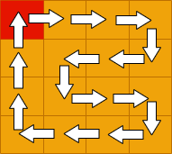
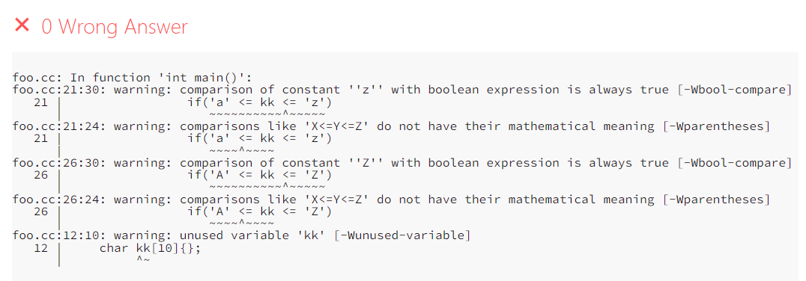

<style scoped>
    section {
  text-align: center;
    }
</style>

<!--
_backgroundImage: url("./images/bg1.jpg")
_paginate: false 
-->


# 数据结构
## 第一次机考讲评


**2023-9-13**


---

<!--_header: 1 上机&作业规则 -->

### 上机测试

#### 时间：每周一上机课， 15:30~17:00

#### 地点：逸夫楼202机房

---

* 上机的形式为闭卷的编程测试，上机测试时：
  * 仅允许使用机房的电脑设备，上机过程中不得使用自己的手机、电脑等电子设备。
  * 仅允许访问OJ网站，不得访问任何其它网站。
  * 所有代码必须在自己在当堂编写，不允许以任何形式提前准备现成的代码，一经发现，0分处理。

---

* 上机测试共三道题，每道题只有（通过，不通过）两种结果，依此结果计分。
* 上机测试保证至少有一道题与上周某一道作业题一样。
* 上机测试中已通过所有题目的同学，可以向助教提出申请，提前离场。


---

### 上机测试-补题

时间：周一 17:00 开始，周三 13:30 结束

* 补题窗口以作业的形式提供。
* 赛时没通过的题目在补题时间内**通过**，可以获得50%的分数。

---

### 作业

时间：每周三 23:59 开始，周日 23:59 结束 （可能会提前若干小时开始）

* 每周作业题目数量为 4~6 题，在结束之前**通过**超过 50% 的题目则可以获得满分。
* 若作业中出现未经说明的抄袭代码行为，一经发现，则会扣除所有分数。


---
<!--_header: A. 姓名格式化 -->

#### 题意

* 输入 $n$ 行字母字符串，每行2个。把每个字符串统一成首字母大写其余字母小写的格式，并输出。


---
<!--_header: A. 姓名格式化 -->
#### 做法

* 模拟即可，需要熟悉字符串的输入、输出与存储。
* 大小写字母转换:（以`char ch;`为例）
  * 大转小：`ch+='a'-'A';`
  * 小转大：`ch+='A'-'a';`

---

<!--_header: B. 网格图上的Hamilton回路 -->
#### 题意

* 构造 $n\times m$ 网格图上的哈密尔顿回路，规定起点为 $x,y$ ，并输出完整回路。


---

<!--_header: B. 网格图上的Hamilton回路 -->
#### 构造思路

 偶数行：来回填充

---

<!--_header: B. 网格图上的Hamilton回路 -->

输出答案

* 因为是回路，所以任何一个点都可以作为起点。
* 先任意找个起点把长度为 $n\cdot m$ 的路径点记录下来，看作一个环（可以用数组存储）。然后以 $x,y$ 为开始点，走一圈输出路径即可。

---

<!--_header: C. 树的遍历 -->

#### 题意

* 给出一棵二叉树的前序遍历（根，左，右）和逆后序遍历（根，右，左），还原每个结点的父亲结点编号。

* 不妨令这两个序列分别为 $A$ , $B$
---

#### 递归算法

考虑函数 $solve(A[l_a,r_a],B[l_b,r_b])$ ，意思是根据这两段序列还原一棵树。

 此时可以确定这棵树的根结点，以及根节点的两个孩子的编号。

---
#### 递归算法

考虑函数 $solve(A[l_a,r_a],B[l_b,r_b])$ 
* $root = A[l_a]=B[l_b]$
* $child_l = A[l_a+1],child_r = B[l_b+1]$


找到了两个结点的根，接下来继续对两棵子树分别递归求解。
**递归边界：** 传入的序列长度为 1，不再递归。 
**算法时间复杂度：** $O(n)$

---

<!--_header: D. 最大伤害值 -->
#### 题意
给出：
* 长度为 $n$ 的序列 $a_1,a_2,\cdots a_n$
* 长度为 $m$ 的序列 $b_1,b_2,\cdots b_n$

第 $i$ 行第 $j$ 列的士兵生命值为 $a_i + b_j$
要求找到一个最大的 $D$ ，使得至少有 $K$ 个士兵生命值超过 $D$

---

#### 做法

二分答案
* 如果伤害值 $D_1$ 使得不足 $K$ 个士兵体力超过它，那么答案肯定 $<D_1$
* 如果伤害值 $D_2$ 使得不足 $K$ 个士兵体力超过它，那么答案肯定 $\ge D_2$

实现函数 $Greater\_cnt(X)$ 来计算体力值超过 $X$ 的士兵数量。
然后通过 $\log_2 D_{max}$ 次二分查找，获得答案

---
#### $Greater\_cnt(X)$ 实现

* 遍历所有的士兵复杂度 $O(nm)$ 不可以接受。
* 利用 $c_{i,j} = a_i+b_j$ 的性质，先分别对序列 $A,B$ 进行排序，然后双指针扫描统计。
* 复杂度 $O(n+m)$

算法总时间复杂度：$O((n+m)\log D_\max )$

---
<!--_header: E. 彩砖大师 -->
#### 题意
* 给出一个地板，有些位置没有铺砖，有些位置已经铺砖。
* 现在需要把砖铺满，每次铺上一块砖的得分是：铺上这块砖时，所在
的连续砖块段的长度。

求最优铺砖策略，使得总得分最大。

---

#### 做法:区间动态规划
* $dp(l,r)$ 表示把区间 $[l,r]$ 上铺满砖的最优总得分。

* 转移方程：考虑区间 $[l,r]$ 中最后一块砖是在哪个位置铺的，比如在 $m，(l\le m\le r)$ 位置铺的，最后这一步的贡献是 $r-l+1$ 。
* 最后一步之前的贡献是 $dp(l,m-1)+dp(m+1,r)$

---

#### 动态规划转移方程
##### $dp(l,r) = \max \bigg\{dp(l,m-1)+dp(m+1,r)+r-l+1 \bigg|l\le m\le r,s[m]\ne \text{\#} \bigg\}$

（边界情况：默认$dp(i,i-1)=0$）

算法时间复杂度：枚举状态 $l,r$ 以及中间点 $m$ ，$O(n^3)$

---
<!--_header: 判题原理 -->

* Online Judge 一般的判题方式是：
  * 题目中有若干成对数据点，包括标准输入和标准输出。
  * 评测机运行你的代码，以标准输入作为程序的输入。
  * 评测机比对你的程序的结果，是否与标准输出完全一致（包括空格、换行等）

---

* 有的题目（极少）可能为 Special Judge，则是用判题程序来判断你的输出是否合法

因此需要特别注意输出的格式，确保不会因为格式错误而 $\color{red}\text{Wrong Answer}$。

---


<!--_header: 提交前-本地测试 -->

* 每道题目都提供样例，提交前应当本地自行测试样例输入输出是否通过。
* 样例不通过的情况下，通常是不可能 AC 的。
---

<!--_header: 输入 -->

#### C风格：

```c++
scanf("%d%lld%f%lf%s", a_int, a_longlong, a_float, a_double, a_char_star);
scanf("%c",a_char);//注意会读取到不可见字符（例如空格、换行等）
fgets(char *s, int size, FILE *stream);//读取一行
```


#### C++风格：

```c++
cin>>
cout<<
cin.getline()
getline()
```

---
<!--_header: 代码问题示例 01 -->

```c++
int main(){
    string s = "Alex";
    for(char c: s){//c未取引用
        c++;
    }
    cout<<s<<endl;
    return 0;
}
//output: Alex
```
---
<!--_header: 代码问题示例 01 -->
```c++
int main(){
    string s = "Alex";
    for(char &c: s){//c取引用
        c++;
    }
    cout<<s<<endl;
    return 0;
}
//output: Bmfy
```
---
<!--_header: 代码问题示例 02 -->
`'a' <= kk <= 'z'`



