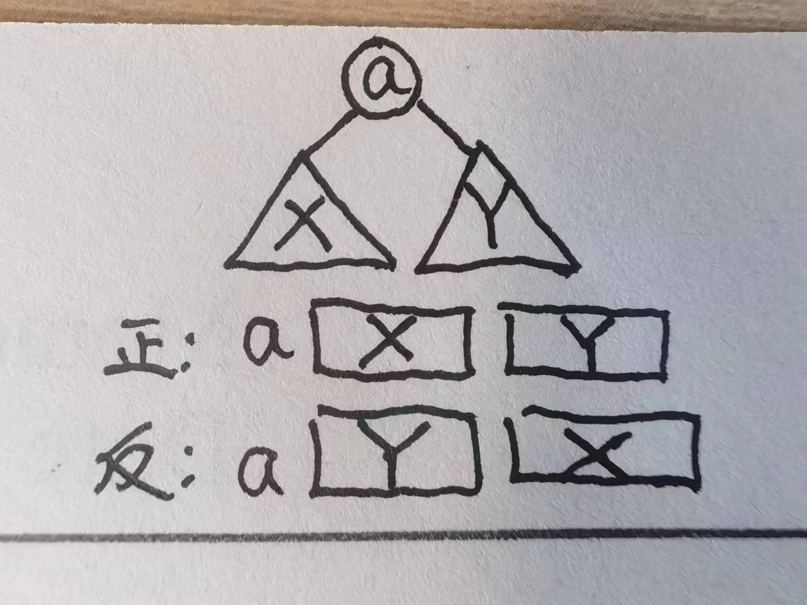

<style scoped>
    section {
  text-align: center;
    }
</style>

<!--
_backgroundImage: url("./images/bg1.jpg")
_paginate: false 
-->


# 数据结构
## 第5次机考讲评


**2023-10-18**

---

<!--_header: A. 求解next数组 -->

### 题意
* #### KMP基础题 求解字符串的next数组

### 做法

* #### 求解 $next(i)$ 时，需要利用 $next(j),j<i$ 的信息，递推即可。假设 $s_{next(i-1)+1} = s_{i}$ ，那么 $next(i) = next(i-1)+1$ ，否则迭代考虑 $next(next(i-1))$ …… 最终需要对 $0$ 的边界做处理。模板如下：

```cpp
    nxt[1]=0;
    for(int i=2,j=0;i<=n;i++){
        while(j && s[j+1] != s[i])j=nxt[j];
        if(s[j+1] == s[i])j++;
        nxt[i] = j;
    }
```

复杂度 $O(n)$ 。

---

<!--_header: B. 周期循环 -->

### 题意
* #### 给出一个字符串 $T$，要求在尾部添加尽可能少的字符，使得添加之后字符串可以被表示为某个子串 $s$ 的 $k$ 次重复，$k\ge 2$

### 做法
* #### 找最小循环节，找到最小循环节 $t$ 之后，把 $T$ 串的长度补成 $t$ 的倍数（且至少为 $2$ 倍）即可。

* #### 结论：最小循环节长度等于 $|T| - next(|T|)$ 。

* #### 证明：https://zhuanlan.zhihu.com/p/368214227

---

<!--_header: C. 数一数 I -->
### 题意
* #### 给出 $n$ 个数，每个数有个权值 $a_i$ ，要求选出一些数，其权值和为 $S$。问有多少种选法。

### 做法1：搜索枚举所有情况

* #### 每个数只有选与不选两种状态，因此总共只有 $2^n$ 种状态。使用递归搜索枚举所有状态。在搜索过程中维护已选数的和，即可 $O(1)$ 检验每组状态是否合法并统计进入答案。时间复杂度 $O(2^n)$，空间复杂度 $O(n)$ 。

### 做法2：状压递推

* #### 用 $[0,2^n-1]$ 的整数的二进制形式，表示一个状态（每个二进制位的0/1对应一个物品选与不选）。定义 $dp(x)$ 表示状态 $x$ 的已选数之和，有递推式 $dp(x) = dp(x-lowbit(x))+a_{log_2(lowbit(x))}$。从小到大递推即可得到每种状态的选数之和。这样做无需递归，但是空间开销为 $O(2^n)$ 。


---

<!--_header: D. 树的遍历 -->
### 可参考第一次上机讲评 

### 题意

* 给出一棵二叉树的前序遍历（根，左，右）和逆后序遍历（根，右，左），还原每个结点的父亲结点编号。

* 不妨令这两个序列分别为 $A$ , $B$
---

### 递归算法

考虑函数 $solve(A[l_a,r_a],B[l_b,r_b])$ ，意思是根据这两段序列还原一棵树。

 此时可以确定这棵树的根结点，以及根节点的两个孩子的编号。

---

<!--_header: E. 二叉树上的询问 -->
### 题意

* #### 给出一棵 $n$ 个结点的堆式编号的二叉树（$x$ 的左孩子为 $2x$，右孩子为 $2x+1$）
* #### $m$ 次询问，每次询问 $x$ 结点在这棵树的前序遍历中排名第几。

### 做法：
* #### $n\le 10^{18}$ 肯定不能存下整棵树或者存下前序遍历序列。应当分析并利用二叉树性质。
* #### 该二叉树的深度是 $O(\log_2 n)$ 的，这意味着对于每个询问 $x$ ，其深度最多约为 $60$，因此可以遍历其所有祖先结点。由于前序遍历是根、左、右的顺序，我们可以总结公式快速统计 $x$ 之前遍历的结点数目。

* #### 复杂度： $O(m\log n)$
* #### 细节可参考博客： https://acm.ecnu.edu.cn/blog/entry/26422/ 的 Problem B。

---

<!--_header: . 没人更懂 -->

### 题意

* #### 给出一个平方数 $k(1\le k\le 10^{18})$ 。询问是否存在一个 $n\ge 1$ ，使得 $\sum _{i=1}^n i^2 = k$ 。

### 做法

* #### 从数学层面进行分析，根据 $\sum _{i=1}^n i^2 = \frac{n(n+1)(2n+1)}{6} = k \le 10^{18}$ 可以知道 $n$ 的可能取值不超过 $3\times 10^6$ 种。

* #### 因此可以把 $n\in [1,3\times 10^6]$ 的求和结果预处理出来，形成集合，对每个输入 $k$ 去查找集合里有没有这个值。可以用 set 或者二分查找实现，复杂度 $O(m\log k_{\max})$

* #### 事实上，只有 $k=1$ 或者 $k=4900$ 时有解。因此也可以 $O(1)$ 判断答案。

---

<!--_header: . 构造字符串 -->

### 题意
* #### 给出一个字符串的 $next$ 数组，构造一个字符串满足其 $next$ 数组与输入相同。

### 做法
* #### 遇到 $next(i) = 0$ 则令 $s_i$ 为新的一种字符。否则 $s_i = s_{next(i)}$ 

### 正确性
* #### next 数组本质上给出了字符位置上的一些相等与不等限制（不等限制：为什么next值不会更大？因为匹配时的一些不等而跳next），而因为答案保证合法，所以自然不会有相等限制与不等限制的矛盾。

* #### 把相等的字符集团看成一个结点，不等关系看作结点之间的连边，那么确定每个结点的字符变为一个经典的图染色问题，而该题可用的颜色超过结点数量，因此直接为每个结点染新颜色即可。


 